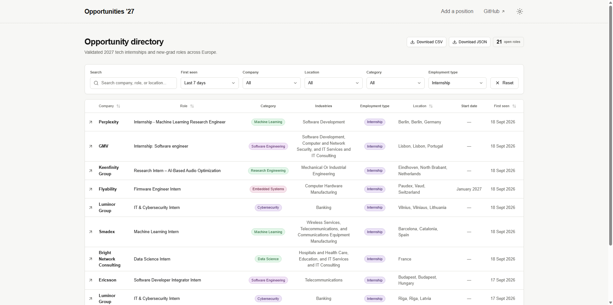
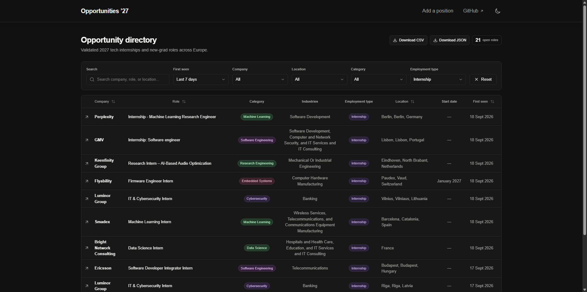

# European Tech Opportunities 2027 Website Guide

[← Documentation hub](../../README.md) · [CLI reference](cli.md) · [Search registry](search-registry.md) · [Docker and deployment](../operations/docker.md) · [Security policy](../../../SECURITY.md) · [Open the live site](https://opportunities2027.simonesiega.com/)

This is the canonical website guide for the project. The [live website](https://opportunities2027.simonesiega.com/) is the primary public interface: it exposes every currently open Internship and New Grad opportunity from canonical SQLite state, while the root README intentionally shows bounded previews for both types.

## Contents

- [Interface](#interface)
- [Search, filters, and sorting](#search-filters-and-sorting)
- [Displayed fields](#displayed-fields)
- [Public data downloads](#public-data-downloads)
- [Data interpretation](#data-interpretation)
- [Accessibility and responsive behavior](#accessibility-and-responsive-behavior)
- [Shareable directory URLs](#shareable-directory-urls)
- [Search and social metadata](#search-and-social-metadata)
- [Read-only database contract](#read-only-database-contract)
- [Local website development](#local-website-development)
- [Production runtime](#production-runtime)
- [Data refresh](#data-refresh)
- [Privacy and browser integrations](#privacy-and-browser-integrations)

## Interface

<p align="center">
  
  
</p>

The directory provides:

- free-text search;
- company, country, technology-category, employment-type, and first-seen recency filters;
- sortable columns;
- pagination with selectable page size;
- light and dark themes stored as browser preferences;
- direct links to public source listings;
- downloadable sanitized CSV and JSON datasets;
- shareable directory URLs covering filters, sorting, page size, and pagination;
- a live result count, equal to the total open-opportunity count when no filters are active;
- the latest successful collection time.

The website supports browsing and comparison only. Applications are completed through the original employer or LinkedIn listing.

## Search, filters, and sorting

Free-text search covers:

- company;
- role title;
- technology category;
- industries;
- employment type;
- location.

Filters can be combined by:

- company;
- country;
- technology category;
- employment type, using a single-select choice of Internship or New Grad;
- first-seen recency, using Last 24 hours, Last 7 days, or Last 30 days.

Sortable columns include:

- company;
- role;
- location;
- first-seen date.

Search, filtering, sorting, page size, and pagination affect only the displayed result set. The table defaults to newest first with 10 rows per page and offers 10, 20, 30, 50, or 100 rows per page. None of this presentation state mutates canonical state or influences collection.

The complete directory view is encoded in the URL so its filters, sorting, page size, and current page can be bookmarked or shared. Default values are omitted to keep canonical URLs concise.

A browser interaction or URL state is not lifecycle evidence, collection input, or a pipeline instruction.

## Displayed fields

| Column | Source and behavior |
|---|---|
| Company | LinkedIn detail heading, with search-card fallback |
| Role | Normalized detail title, with search-card fallback |
| Category | Deterministic internal technology classification |
| Industries | Structured LinkedIn `Industries` criterion |
| Employment type | Deterministic title classification; always `Internship` or `New Grad` |
| Location | Normalized explicit detail or search-card location |
| Start date | Explicit month or season plus year from title or narrow start-date context |
| First seen | Inferred publication time from LinkedIn's relative posting age when available on first acceptance; otherwise the first accepted observation; immutable afterward |

The website renders normalized publication fields rather than raw source HTML.

External application links are validated canonical LinkedIn HTTPS URLs whose numeric path matches the stored job identity.

## Public data downloads

Two download controls appear immediately to the left of the open-role count:

- **Download CSV** → `/open-opportunities.csv`;
- **Download JSON** → `/open-opportunities.json`.

Both files contain every currently open opportunity at generation time. Their fixed schema includes only LinkedIn job ID, company, title, location, canonical listing URL, category, industries, employment type, and start date. They exclude status, first/last-seen and update timestamps, provenance, search runs, closure evidence, diagnostics, and all other lifecycle or operational state.

The Python pipeline generates and validates both files from canonical SQLite. CSV output neutralizes cells that spreadsheet applications could interpret as formulas. The website serves the generated files as read-only attachments and returns a generic unavailable response when a file is absent; it never creates exports from browser input.

Downloads represent the latest deployed projection and are not a canonical backup or complete historical dataset.

## Data interpretation

`Not specified` means that optional structured metadata such as industries was absent, unsupported, or not accepted by the parser. Employment type is required for every published row.

The project does not infer structured values from arbitrary description keywords merely to fill missing cells.

The website does not claim:

- application eligibility;
- visa sponsorship;
- compensation;
- remote-work eligibility;
- application deadlines;
- continued availability beyond the source listing;
- complete coverage of European technology internships.

Verify role requirements, location, deadline, compensation, work authorization, and current availability on the original listing before applying.

For a new row, `First seen` uses LinkedIn's relative posting age when it is available at the first accepted observation and otherwise uses that observation time. An inferred value is an approximate publication timestamp rather than an exact employer-supplied date, and later observations do not rewrite either value.

A listing may disappear from search results without being marked closed. Closure follows the explicit lifecycle rules in [Database lifecycle](../operations/database.md#closure-lifecycle).

## Accessibility and responsive behavior

Website changes should preserve:

- semantic headings, landmarks, tables, labels, and controls;
- keyboard access to interactive elements;
- visible focus behavior;
- meaningful link and button text;
- readable light and dark themes;
- responsive layouts for desktop, tablet, and mobile widths;
- usable empty, loading, and no-result states;
- stable search, filter, sort, and pagination behavior.

The empty directory is a valid state when the configured database contains no open listings.

Playwright runs axe-core WCAG 2.0, 2.1, and 2.2 A/AA checks against the normal directory, a filtered view, an empty-result view, and dark mode. These automated checks complement rather than replace keyboard and assistive-technology review.

## Shareable directory URLs

The directory recognizes these query parameters:

| Parameter | Meaning |
|---|---|
| `q` | Free-text search |
| `company` | Exact company option |
| `country` | Exact country option |
| `category` | Exact internal technology category |
| `type` | Exact normalized employment type: `internship` or `new-grad` |
| `first-seen` | Recency window based on the directory's first observation: `24-hours`, `7-days`, or `30-days` |
| `sort` | Sort field and direction, such as `first-seen-desc`, `company-asc`, `role-desc`, or `location-asc` |
| `page-size` | Rows per page: `10`, `20`, `30`, `50`, or `100` |
| `page` | One-based result page |

For example:

```text
https://opportunities2027.simonesiega.com/?country=Germany&type=internship&first-seen=7-days&sort=first-seen-desc
```

Selecting a filter, sorting a column, changing page size, or moving between pages updates browser history, and browser back/forward navigation restores the complete earlier view. Search typing replaces the current history entry to avoid creating one entry per keystroke. Changing filters, sorting, or page size returns the view to page one. Reset removes the filter parameters and current page while preserving sorting, page size, and unrelated parameters.

The first-seen filter uses the immutable canonical `first_seen_at` value relative to the directory request time. It describes when this project first accepted the listing, not when the employer posted it.

Unsupported filter, sort, page-size, and page values are ignored or safely constrained. Query parameters are untrusted presentation input and never reach a database write path.

## Search and social metadata

The website publishes:

- a canonical URL that excludes transient filter parameters;
- descriptive title, description, authorship, and crawler directives;
- Open Graph and large-card social metadata;
- a generated 1200 × 630 social preview image;
- `/robots.txt`, `/sitemap.xml`, and `/manifest.webmanifest` metadata routes;
- schema.org JSON-LD describing the directory as a `WebSite` and the downloadable collection as a `Dataset`, including its Europe coverage, 2027 cycle, MIT license, maintainer, daily update schedule, latest successful collection time, and CSV/JSON distributions.

The structured data describes the directory-level dataset only. It does not emit `JobPosting` records for individual source listings because the directory does not own or expose every field required for compliant job-posting markup.

`SITE_URL` must contain the canonical public origin so absolute metadata, sitemap, structured-data download, and crawler URLs are correct in production.

## Read-only database contract

Website database access lives under:

```text
site/src/lib/
```

`site/src/lib/opportunities.ts` opens SQLite in read-only mode and queries currently open jobs newest-first by `first_seen_at`, with LinkedIn job ID as the stable tie-breaker.

It also reads the latest successful collection timestamp from `search_runs` for public status metadata; a later failed run cannot make the displayed data appear fresher.

The root page is dynamically rendered. Each server request opens a short-lived read-only database connection and closes it after loading the directory data.

The website:

- never runs migrations;
- never inserts, updates, closes, or reopens jobs;
- never performs LinkedIn requests;
- never treats browser activity as canonical state;
- never exposes a mutation API;
- serves only the two fixed generated public-export filenames;
- observes a newly deployed database and exports on subsequent requests.

The Python pipeline is the sole application writer.

Authentication, user-provided content, saved application state, write endpoints, or administrative mutation interfaces require an explicit architecture and security decision before implementation.

## Local website development

A fresh local database intentionally contains no listings, and the website must render that valid empty state correctly.

For installation, database initialization, environment-file creation, and first launch, use [Installation](../getting-started/installation.md#run-the-website).

Website runtime variables are documented in [Configuration](../getting-started/configuration.md#website-settings). Components use Tailwind CSS utility classes; `site/src/app/globals.css` owns only the Tailwind import, shared design tokens, theme selectors, and base document rules.

Install the Playwright Chromium browser once, then run the complete website checks:

```bash
cd site
bunx playwright install chromium
bun run ci
```

`bun run ci` checks formatting, lint, strict TypeScript, the production build, Bun unit tests, Playwright browser behavior, and axe-core accessibility scans against a generated temporary SQLite fixture. It does not contact LinkedIn.

The complete validation path and coding expectations are documented in [Development](../development/development.md#website-validation).

## Production runtime

The root Dockerfile’s `site` target:

1. installs dependencies from the frozen Bun lockfile in a disposable Alpine build stage;
2. builds Next.js standalone output under Node.js 26;
3. copies only required standalone and static output into a Debian 13 slim runtime image;
4. installs exact reviewed Debian security revisions and removes npm from the runtime;
5. runs as UID/GID `10001:10001`;
6. reads `/app/data/opportunities.db` from a read-only bind mount;
7. listens on container port `3000`.

Every route receives defensive content-type, referrer, framing, cross-origin, and permissions headers. Production additionally sends a Content Security Policy and `Strict-Transport-Security: max-age=63072000; includeSubDomains; preload`; Docker CI smoke-tests both production-only headers.

Production variables:

```dotenv
SITE_URL=https://opportunities2027.simonesiega.com
OPPORTUNITIES_DATABASE_PATH=/app/data/opportunities.db
OPPORTUNITIES_PUBLIC_EXPORT_DIR=/app/data/exports
```

`SITE_URL` defines the canonical public origin used by website metadata.

A reverse proxy such as Dokploy routes the public domain to the `site` service on container port `3000`; a fixed host port is not required.

Image targets, volumes, permissions, and routing are documented in [Docker and deployment](../operations/docker.md#dokploy-deployment).

## Data refresh

The website never collects, migrates, or synchronizes data itself.

Normal automation keeps collection/review and production deployment separate:

1. the controlled pipeline writer performs availability auditing and/or collection;
2. the resulting canonical state and public exports are validated, then SQLite is checkpointed and published as a verified durable snapshot;
3. the owned README projection is proposed through the scoped automation pull request;
4. after review and merge, deployment-only automation restores the reviewed durable state, regenerates the public exports, and validates every projection against `main`;
5. the production SQLite file and generated downloads are checksum-verified and replaced in the shared host state directory.

The website opens a new read-only connection on the next request, so reviewed deployed state becomes visible without an application rebuild, write endpoint, or in-process migration.

Do not run a second local or VPS collector while GitHub Actions owns canonical state.

Workflow orchestration belongs to [Automation](../operations/automation.md), and canonical state recovery to [Database lifecycle](../operations/database.md).

## Privacy and browser integrations

The canonical production layout loads the hosted Umami analytics script from `https://cloud.umami.is/script.js` and restricts collection to `opportunities2027.simonesiega.com`. The script is rendered only when `NODE_ENV` is `production` and the configured `SITE_URL` hostname is that canonical domain, so it is absent from development, tests, and noncanonical deployments. This third-party browser integration must remain within privacy and security review.

The directory itself requires no:

- account;
- login;
- application form;
- LinkedIn credential;
- uploaded résumé;
- saved personal profile.

No internship application is submitted through this project.

Before changing analytics or adding advertising, authentication, forms, error tracking, or another browser integration:

1. document the complete data flow;
2. identify data collected from visitors;
3. review client-visible environment variables;
4. define retention, consent, and disclosure requirements;
5. update security and privacy documentation;
6. prevent exposure of database paths, secrets, or operational metadata.

Security-sensitive changes must follow [`SECURITY.md`](../../../SECURITY.md).
